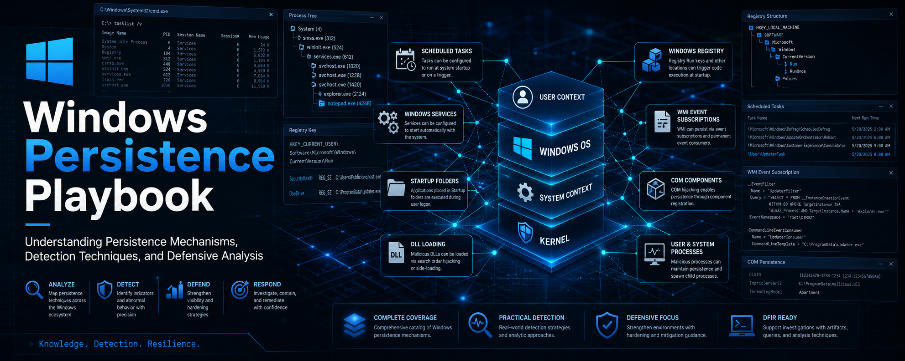

# Windows Persistence Playbook

## Overview

This repository documents the most common Windows persistence techniques used in red team operations and real-world adversary simulations.

The goal is to understand how attackers maintain access after initial compromise.

---

## 🎯 Covered Techniques

This project focuses on the **Top 5 persistence methods** used in Windows environments:

1. [Registry Run Keys / RunOnce](01-registry-run-keys.md)
2. [Scheduled Tasks](02-scheduled-tasks.md)
3. [Windows Services](03-windows-services.md)
4. [Startup Folder Execution](04-startup-folder.md)
5. [WMI Event Subscription](05-wmi-event-subscription.md)
